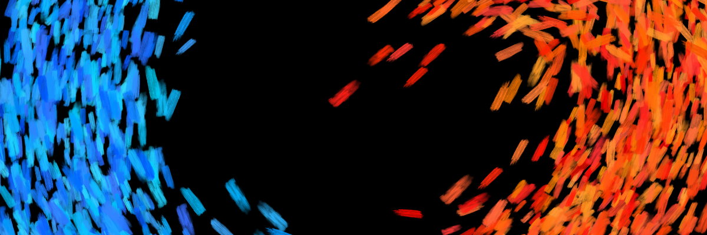
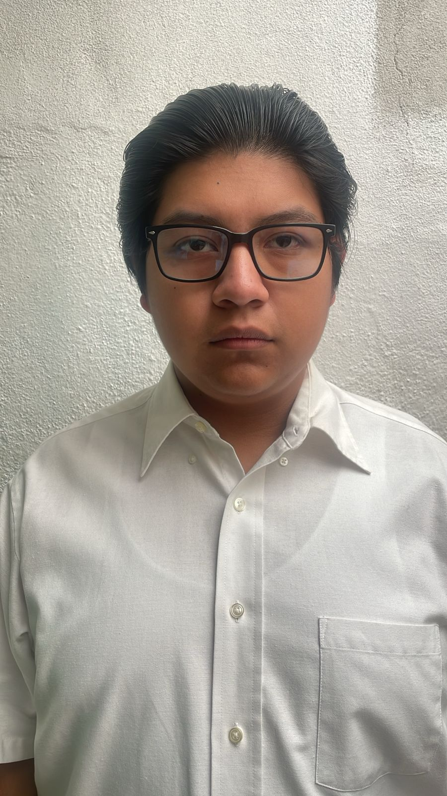
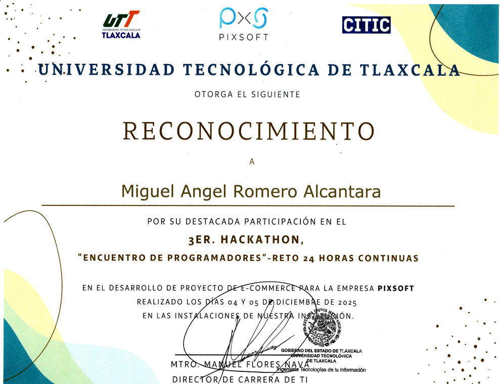
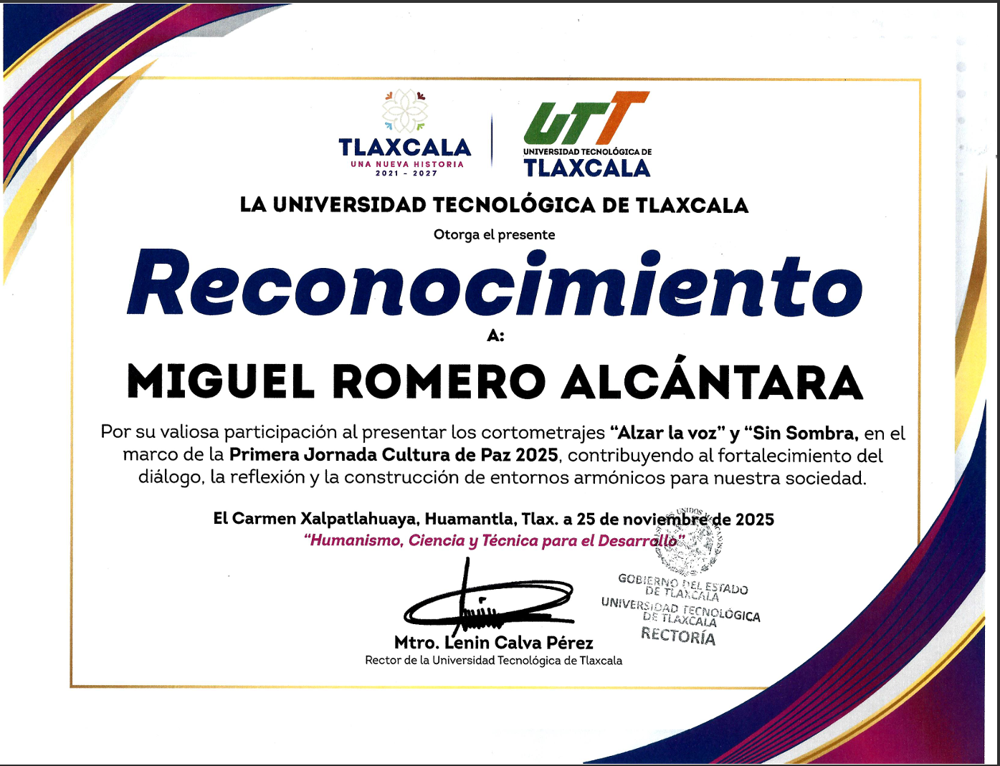
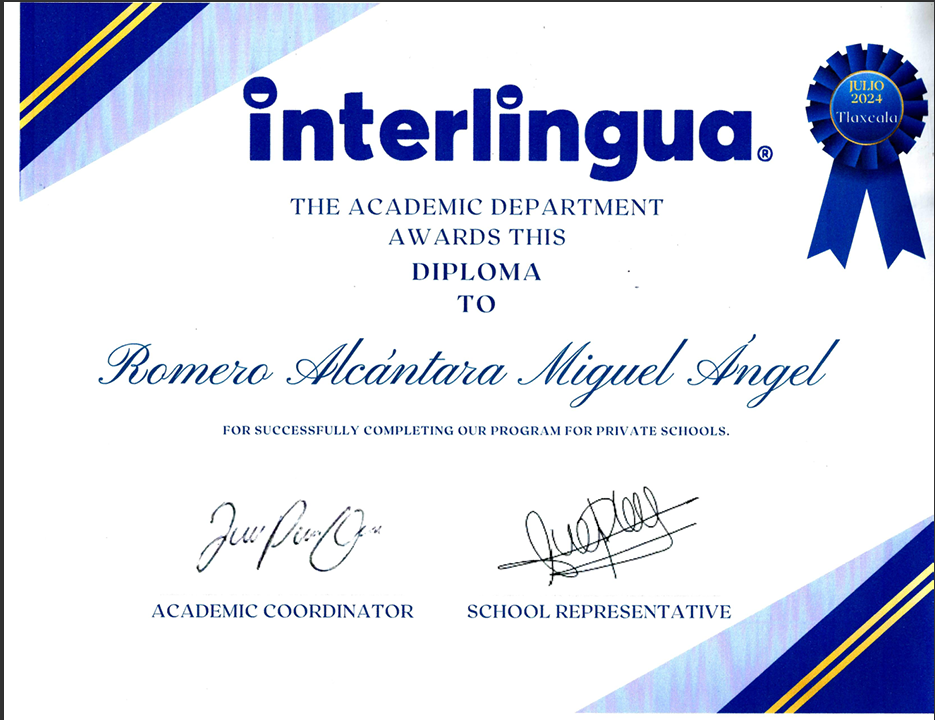
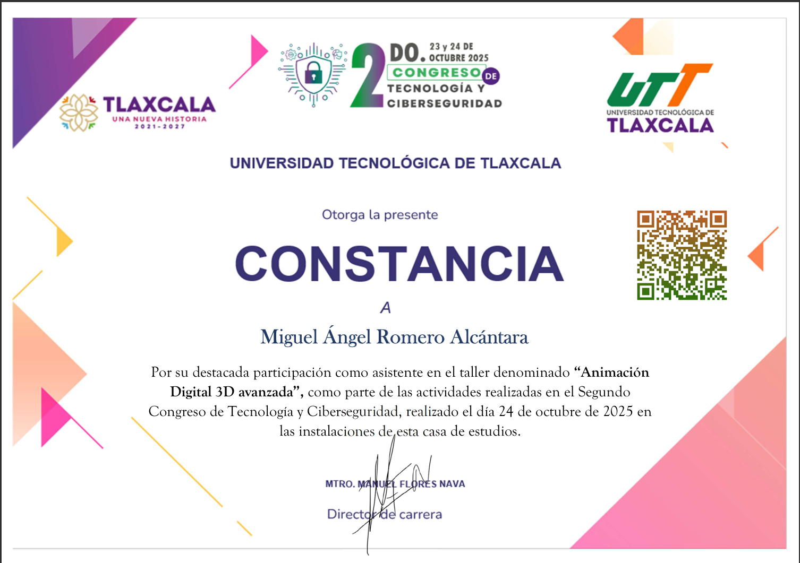
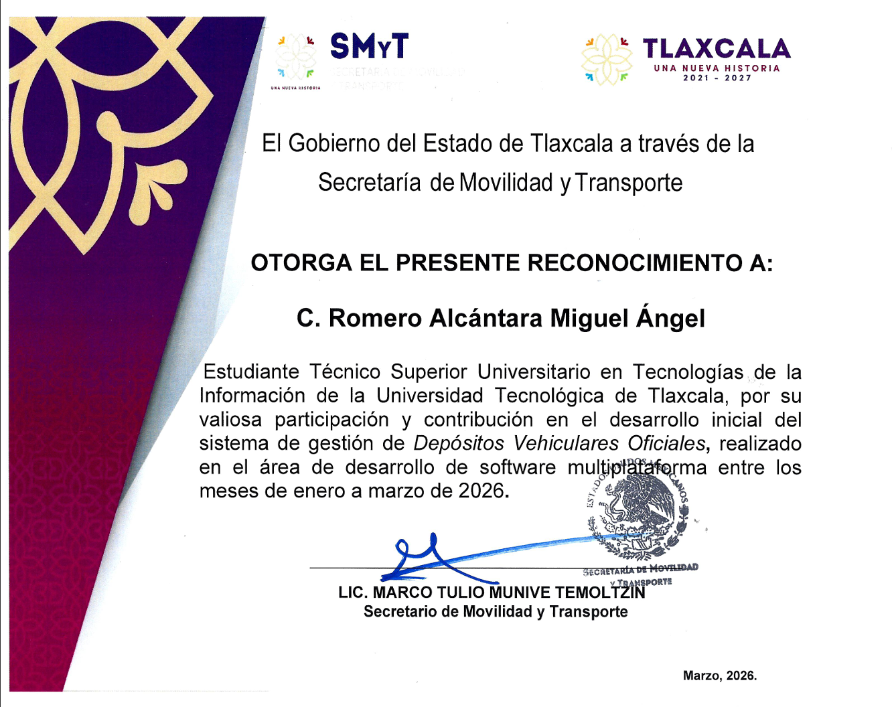

<h1 align="center">👋 Hola, soy Miguel Angel Romero Alcantara</h1>
<h3 align="center">💻 Programador Web | 🕶️ VR & AR Developer | 🎨 Editor Multimedia</h3>
<h3 align="center"> Universidad Tecnologica de Tlaxcala</h3>

Apasionado por crear experiencias digitales interactivas y eficientes.

---

<h1 align="center"> Bienvenido a mi CV Digital</h1>

## 🚀 Sobre mí

Soy programador especializado en desarrollo de páginas web y en la creación de experiencias interactivas usando **Realidad Virtual (VR)** y **Realidad Aumentada (AR)**.

Me enfoco en crear aplicaciones eficientes, intuitivas y con experiencias agradables para los usuarios.

También tengo experiencia en edición de contenido multimedia como **imagen, video y audio**.

---

## 🛠️ Tecnologías y herramientas

  

  
  
  
  
  

---

## 🌟 Objetivo Profesional

Desarrollarme como programador en el área de desarrollo web y realidad virtual, creando experiencias innovadoras que aporten valor a los usuarios.
---

## 💪 Fortalezas

- ⏱️ Puntualidad en entregas y compromisos  
- 🤝 Excelente trabajo en equipo  
- 🎨 Creatividad en el desarrollo de proyectos  
- 🎓 Nivel de inglés B2
---

## 🚀 Proyectos Destacados

🔹 **Proyecto VR educativo**
Aplicación en Unity donde el usuario interactúa con objetos (plantas) en realidad virtual, incluyendo físicas, audio y controles VR.

🔹 **Sistema E-commerce ALUMA**
Sistema desarrollado con base de datos para gestión de productos, pedidos y clientes.

🔹 **Editor multimedia**
Edición de contenido audiovisual utilizando herramientas profesionales como Photoshop y Premiere Pro.

---

---

## 📜 Certificaciones

<table>
<tr>

<td align="center">
 
<b>Hackaton 2025</b> 
Diciembre, 2025 
<a href="1.pdf">Ver certificado</a>
</td>

<td align="center">
 
<b>Primera Jornada Cultura de Paz</b> 
Noviembre, 2025 
<a href="2.pdf">Ver certificado</a>
</td>

<td align="center">
 
<b>Inglés Diploma</b> 
Julio, 2024 
<a href="3.pdf">Ver certificado</a>
</td>

<td align="center">
 
<b>Animación Digital 3D avanzada</b> 
Octubre, 2025 
<a href="4.pdf">Ver certificado</a>
</td>

<td align="center">
 
<b>Secretaría de Movilidad y Transporte</b> 
Marzo, 2026 
<a href="5.pdf">Ver certificado</a>
</td>

</tr>
</table>

----

## 📫 Contacto

📧 miguelromeroalcantara@gmail.com  
🐙 GitHub: https://github.com/starligth99  
📱 2471277730  
📸 Instagram: @Starligth_r.t_99  

## 📄 Descargar CV

